# Project_Games
# Exploratory Data Analysis of 
## Table of Contents
1. Introduction
2. Importing Libraries
3. Data Acquisition & Description
4. Data Pre-Processing
5. Data Analysis
6. Regional User Profiles
7. Hypothesis Testing
8.  Conclusion
## 1. Introduction
This section will introduce the purpose and objectives of your analysis, focusing on video game sales.
## 2. Importing Libraries
In this section, we import the necessary libraries for data manipulation, analysis, and visualization. These libraries provide a range of functions that facilitate our exploratory data analysis.
import numpy as np
import pandas as pd
import matplotlib.pyplot as plt
import seaborn as sns
import plotly.express as px
import streamlit as st
from scipy import stats
%matplotlib inline
## 3. Data Acquisition & Description
### 3.1 Reading CSV File: Load your video game sales dataset.
games = pd.read_csv(r'C:\Users\James\Project_games\games.csv')
### 3.2 Overview of the Dataset: Display the first few rows, shape, and data types. Provide a brief description of each column.

## 4. Data Pre-Processing
### 4.1. Handling Missing Values and Data Types: Address missing values, convert data types, and deal with 'TBD' values.

### 4.2. Adding New Columns: Calculate total sales for each game.
## 5. Data Analysis
### 5.1 Game Release Trends
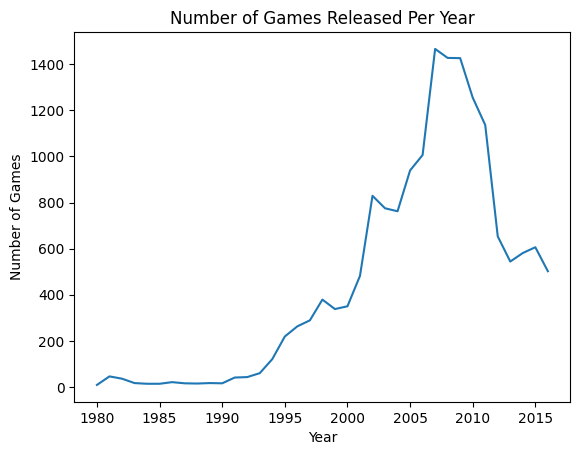
### Industry see fluctuations in the number of games released over the years, possibly correlated with technological innovation and platform transitions. 
### 5.2 Sales Variations Across Platforms
Group by platform and sum up the total sales
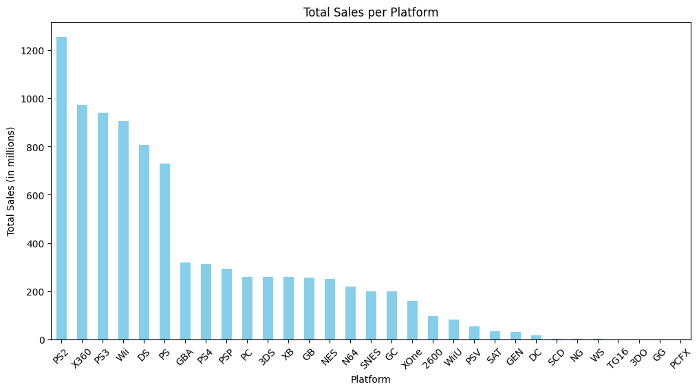
### Sales varitions across platforms. the bar chart showcase total sales per platform indicated a clear hierachy in platform populartiy. specifically the PS2
### 5.3 Platform Life Cycles
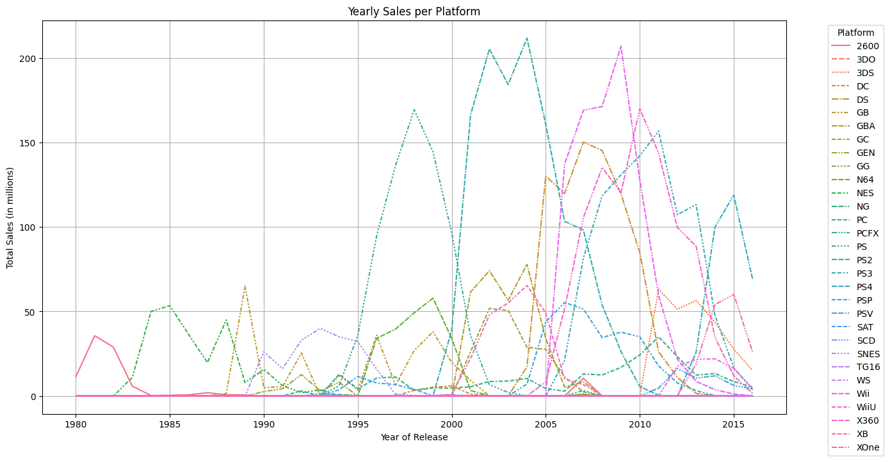
### Platform life cycle the line graphy depicts yearly sales per platform and show the rise and fall of each one. Specially the Wii and PS2 with decliing after hitting record sal
### 5.4 Global Sales Analysis
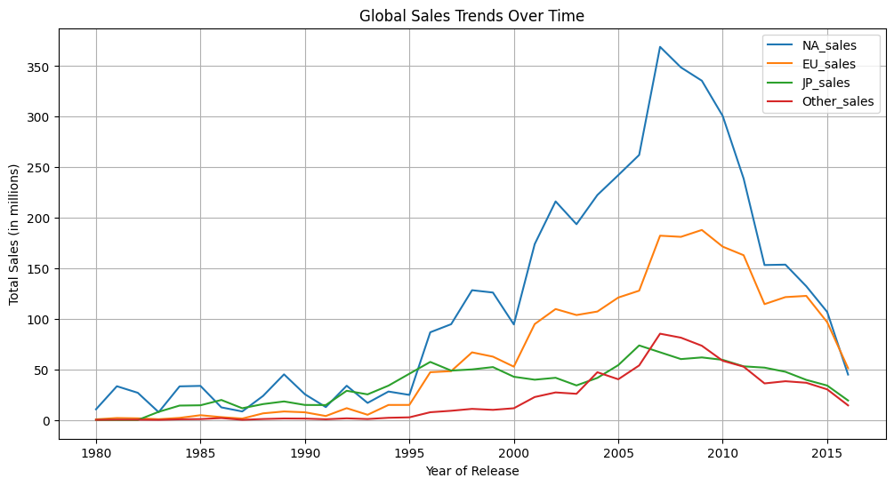
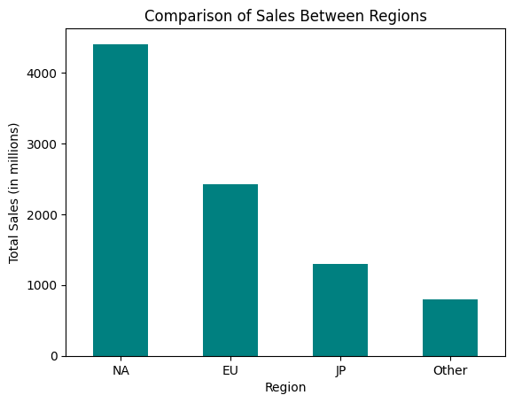
### Global Sales Analysis sales trend over time showed significant regional differences with njorth america an deurope being the largest markets. peak sales areound mid 2000 to early 2010. 
### 5.5 User and Critic Review Analysis
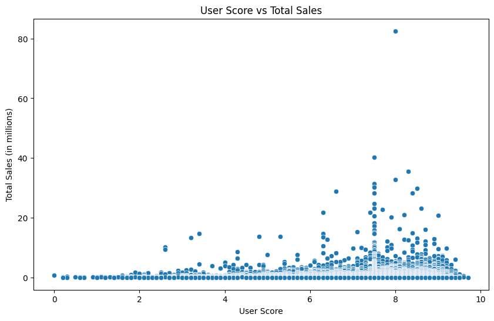
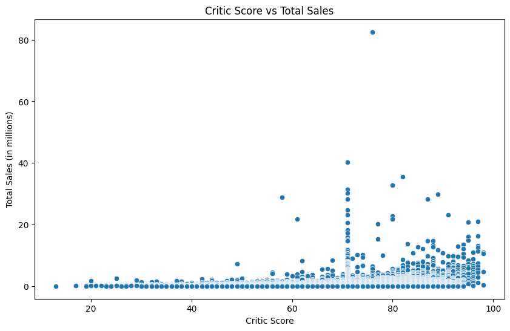
### User and critics review using scatter plots that if you have a higher score you typically gurantee higher sales, also due to loyalty, marketing, and platform exclusivity 
### 5.6 Comparative Analysis by Genre and Platform
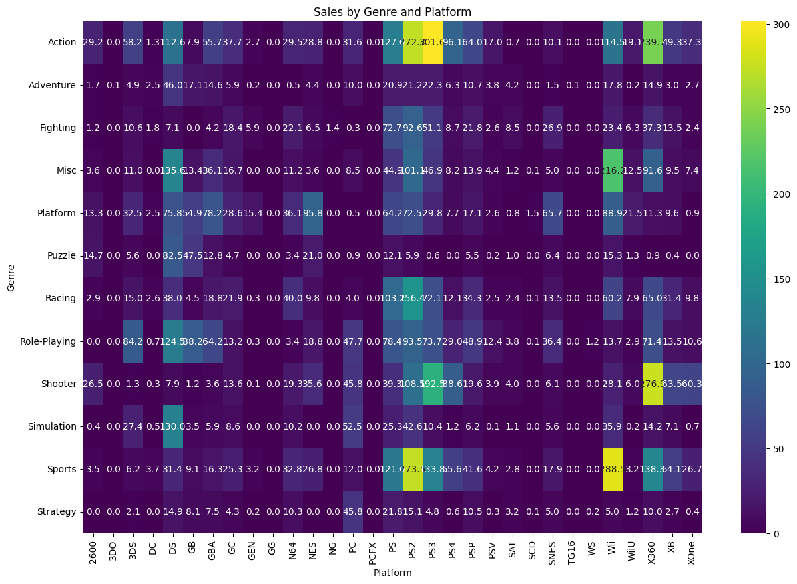
### This helps developer to target which area for greater sales based on genre
## 6. Regional User Profiles
1. Top Platforms and Genres by Region
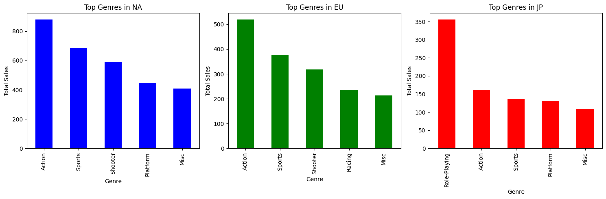
### this shows that sports, action genres work better in NA and EU while role-playing games have strenght in Japan
2. Impact of ESRB Ratings on Sales
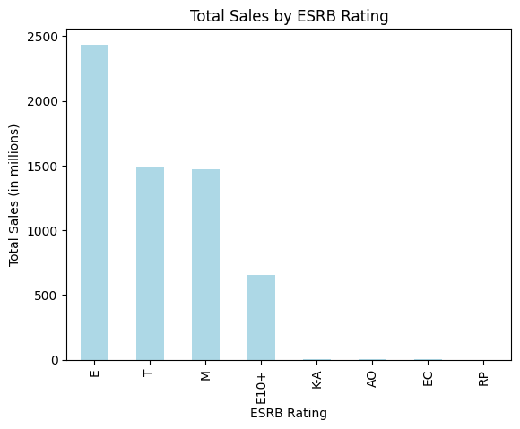
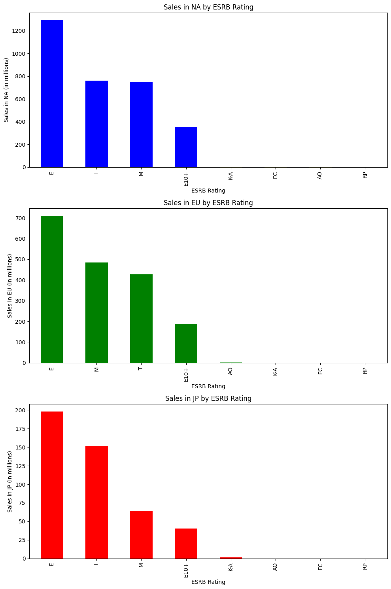
### This really depends on region to show what is the perfence of the market and demographics that are playing on the system. 
## 7. Hypothesis Testing
1. Average User Ratings Comparison: Xbox One vs. PC, and Action vs. Sports genres.
2. Statistical Tests: Outline the methods and results.
## 8.  Conclusion
Summarize the key findings from your analysis.
### . In conclusion gaming industry is marked by evolving trend in platform dominace, gnere, popularity, and regional market perference. The analysis doesn't really show importants aligning to game development with trends and highlights of potential of user rating as a predictor of sales success. Going forward they will need to monitor these patters as technology and platform emerge. 
